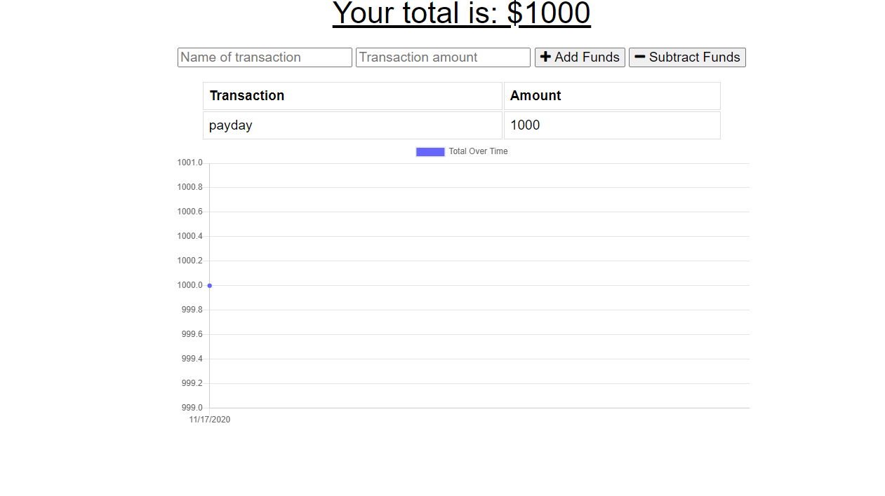

# Budget Tracker
  
   
  

  ## Description

  In this app, the user will be able to track their budget both online and offline. This application is connected to mongodb atlas and indexedDB. When the user enters an a transaction, they can enter a transaction amount and either add or subtract from their budget. If the user needs to update while on the move without internet, their data will be stored in indexedDB and will be entered into the database when they can connect to the server via the internet again.
  
  ## Table of Contents
  * [Installation](#installation)
  * [Usage](#usage)
  * [Contribution](#contribution)
  * [License](#license)
  
  
  Application link : https://budget-trackerz1.herokuapp.com/
  ## Installation
  
  Application is deployed to heroku, no need to install for use. If anyone wished to contribute to the project, all dependencies are listed in package.json. npm install command is all thats necessary.
  
  
  ## Usage
  
  The User will enter in a transaction name and a transaction amount. Then they will click either add funds or subtract funds to add or subtract from budget. A chart at the bottom of the page will be dyncamically updated as data is entered.
  
  ## Techonology
    * MonogDB
    * HTML
    * CSS
    * JavaScript ES6
    * NodeJs
    * Express
     
    
  
  
  ## Contribution
  
  Anyone can contribute to the functionality or presentation of this project.
  
  
  ## License
  
  MIT License
  
  
  ## Questions?
  
  If you have any questions, please contact me with the information below:
  
  Email: oballematt@gmail.com

  Github [@oballematt](https://github.com/oballematt)
  
